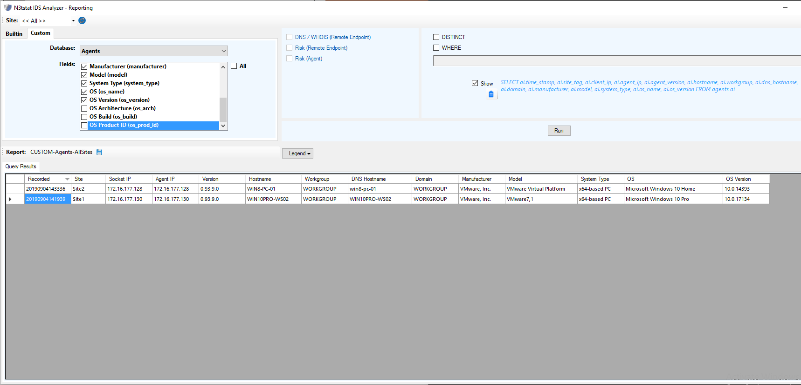
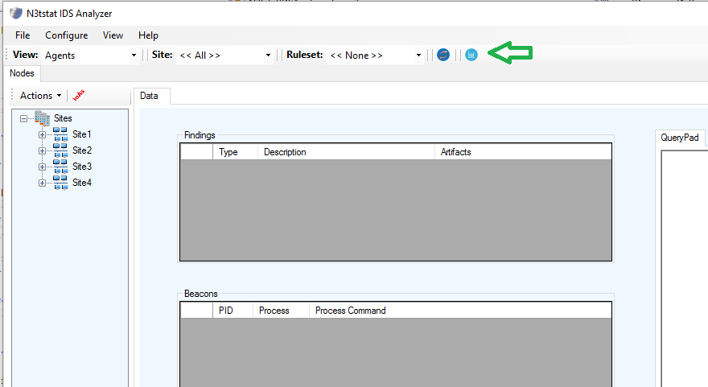
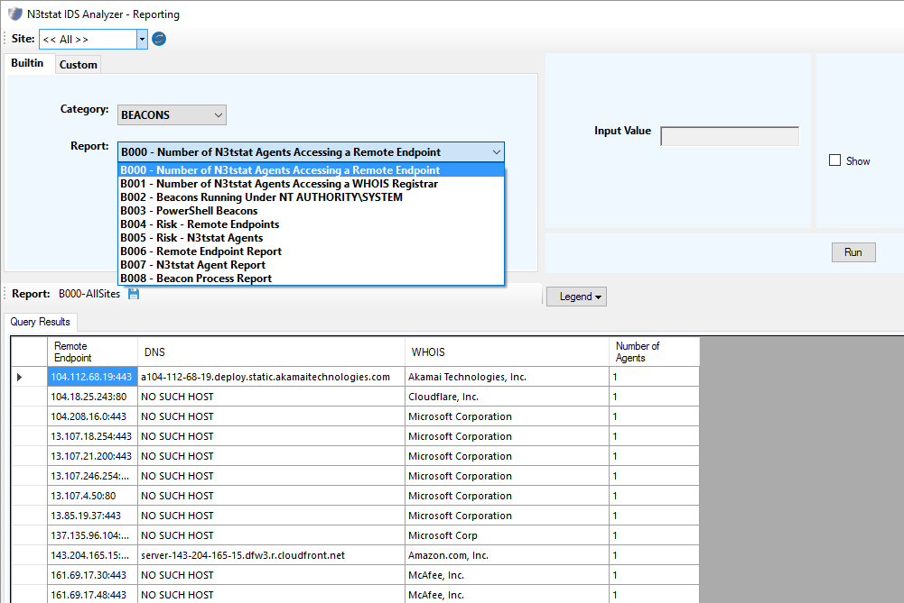
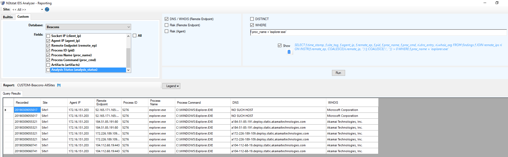

# N3tstat IDS
N3tstat IDS is a lightweight Endpoint Detection &amp; Response (EDR) framework specifically designed for real-time Advanced Persistent Threat (APT) detection. N3tstat IDS provides APT detection capabilities not present in legacy Intrusion Detection System (IDS) solutions and offers the visibility required by cyber security analysts and network defenders to perform proactive threat hunting. 

  * [N3tstat IDS Latest Release Download](../../releases/tag/v0.93.9)

N3tstat IDS utilizes beacon detection and analysis as its primary detection mechanism. High fidelity, context-based beacon detection capabilities start at the endpoint through the continuous collection of process and associated network session information that is analyzed in order to identify anomalous endpoint behavior. Processes like powershell.exe running under SYSTEM and beaconing out to a foreign registered IP address can be readily identified with N3tstat IDS. Determining what processes and users are accessing a remote system over time can lead to the initial detection of malware and associated IOAs such as code execution, privilege escalation, establishing persistence, process migration, lateral movement, and command & control (C&C).  

N3tstat IDS is comprised of 3 primary components: 1) an agent that runs on endpoint systems, 2) a server that collects and records agent results, and 3) an analyzer GUI that provides analysis and reporting capabilities and presents a holistic view of endpoint activities. Endpoint system beacon information (which includes network sessions and associated Registry Internet Registry and DNS information, processes, and users) and relevant event log entries associated with APT Indicators of Attack (IoAs) such as lateral movement, establishing persistence, and detection evasion are continuously collected and analyzed by the agent and results are securely transmitted to the server. Results consist of flagged network sessions having characteristics resembling those of malware beacons employed by an APT and specific event log entries associated with APT IoAs. The analyzer provides an interface to visualize and conduct endpoint behavior analysis as well as canned and custom reporting capabilities to facilitate the identification of abnormal endpoint behavior patterns. Collected endpoint data can be easily exported to any SIEM solution for further correlation and analysis with data collected from other security products.

At this time, only Microsoft Windows platforms are supported.

# NEW Enhancement - 16 SEP 2019
Agent now collects endpoint information to include computer system (e.g. hostname, workgroup, domain, manufacturer, model, etc.) and operating system (name, version, architecture, build type, etc.) information which is made available via reporting interface.

# NEW Enhancement - 13 MAR 2019
New reporting interface added to N3tstat IDS Analyzer and made available in the latest release providing additional analysis and reporting capabilities.

Click on reporting icon pointed to by the green arrow

Built-in reports interface

Custom reports interface

# Resources
  * [N3tstat IDS Overview](https://drive.google.com/open?id=1KHjN51AvoFJiQ_Xz7guSLbs9BgeaZRTc)
  * [N3tstat IDS Introduction Demo](https://www.youtube.com/watch?v=14pTenY9ayQ)
  * [N3tstat IDS Demo - Detection of ACT PowerShell Tools](https://youtu.be/TKyIADfkEME)
  * [N3tstat IDS IoAs](https://drive.google.com/open?id=16__4C5h8PRBnNvWNxgCbh7ATfi5Qu5C_)
  * [N3tstat IDS Download](../../releases/tag/v0.93.8)
